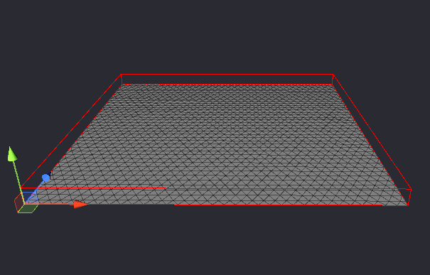
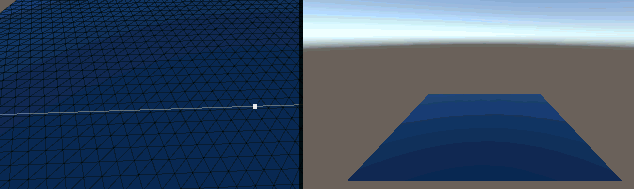
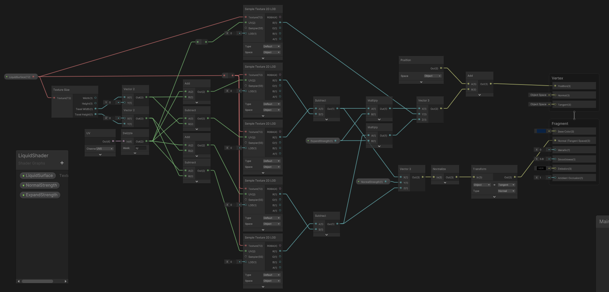

# LiquidSurface

 

## Description
Small experiment that generates an optimal triangle surface for vertex animation.  
It tries to optimize calculations by using a shader to handle the spring physics (for paralell gpu processing).  
Outputs a RenderTexture that can be plugged into custom materials as height map.  
 

## Installation
- Copy the two shaders and the csharp script somewhere into your **Unity** project hierachy
- Add liquidsurface.cs as a component to an empty game object; it will generated the mesh for you (values adjustable)
- Create a custom shader (or graph); use _LiquidSurface texture to get height (r) and velocity (g); attatch shader material to the mesh
- The script has a testing loop attatched by default. Click on the surface to trigger an impact. Remove from update loop if testing environment is not needed
 

## Tips for Shader
  
The spring height map only handles up and down.  
To also include vertex offset into other directions (and calcualte the normal map) you will need to look up it's pixel neighbours.  
Below is an example on how a shadergraph like that could look like.  

 

## Notes
- Validate warnings can be ignored
- Might be slightly optimizable with compute shaders or tesselation
- Too high values make the shader freak out (especially spread)
- Could also be used for snow by turning spring forces way down
- Keep in mind each surface has it's own rendertarget and calculations so use sparingly
- This setup only works on newer Unity versions since it uses the newer Mesh API which was introduced in Unity 2020
